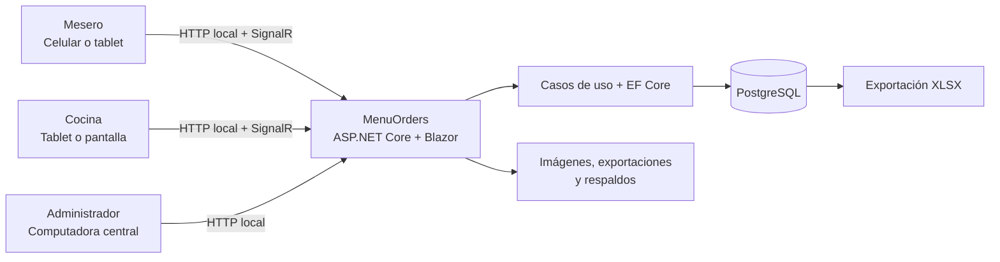
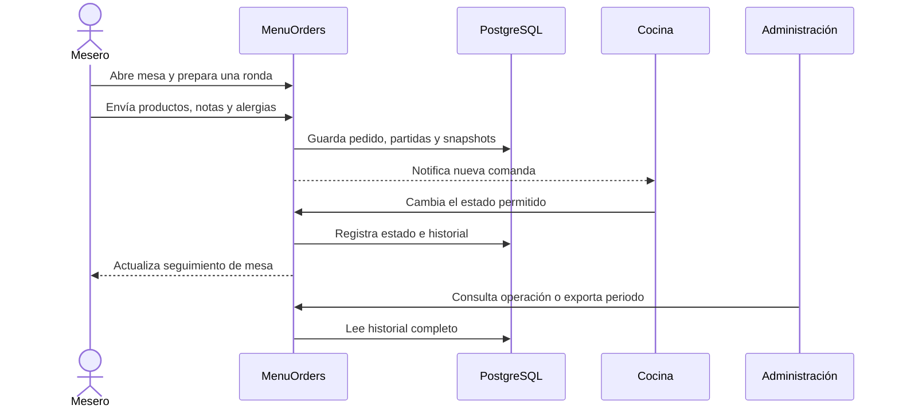
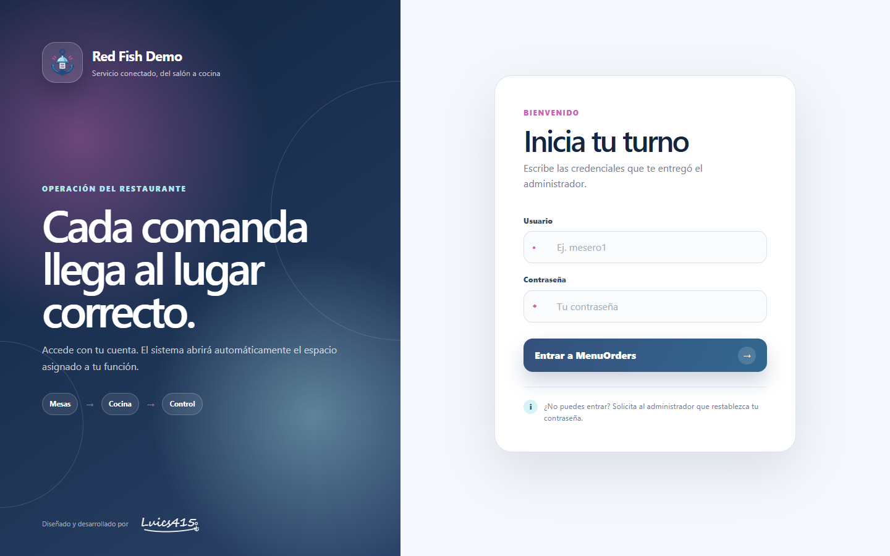
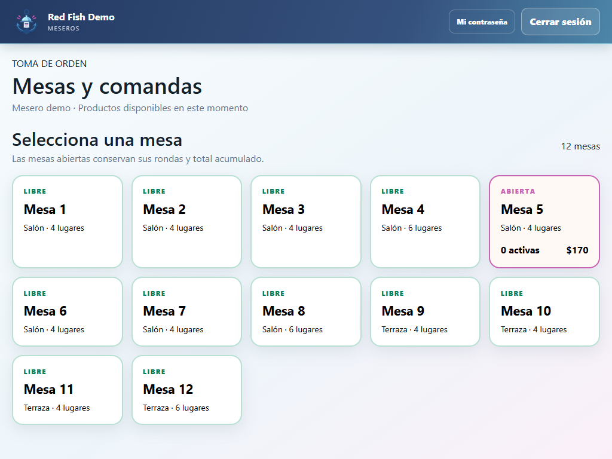
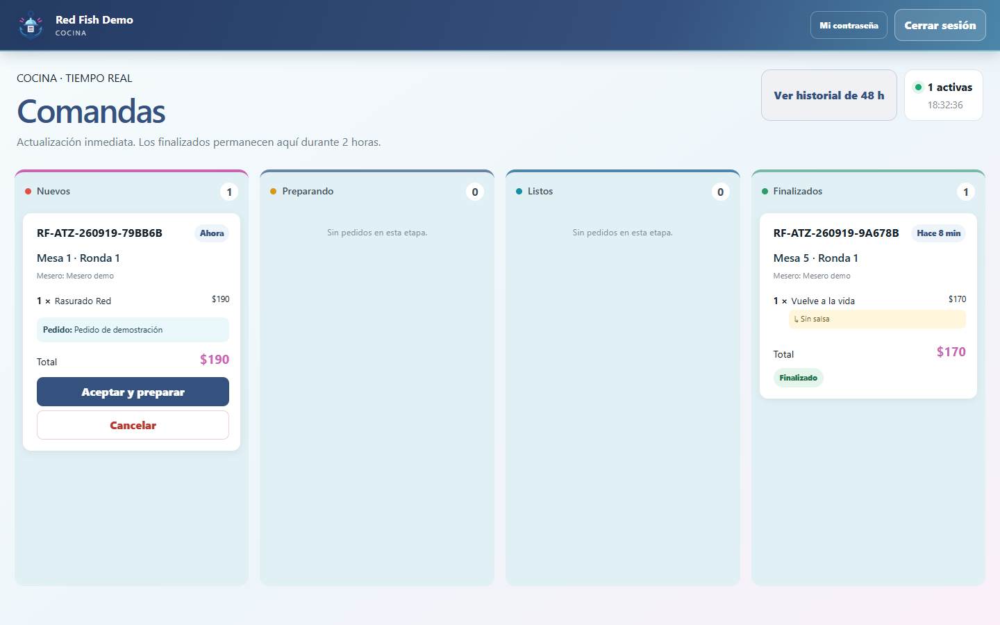
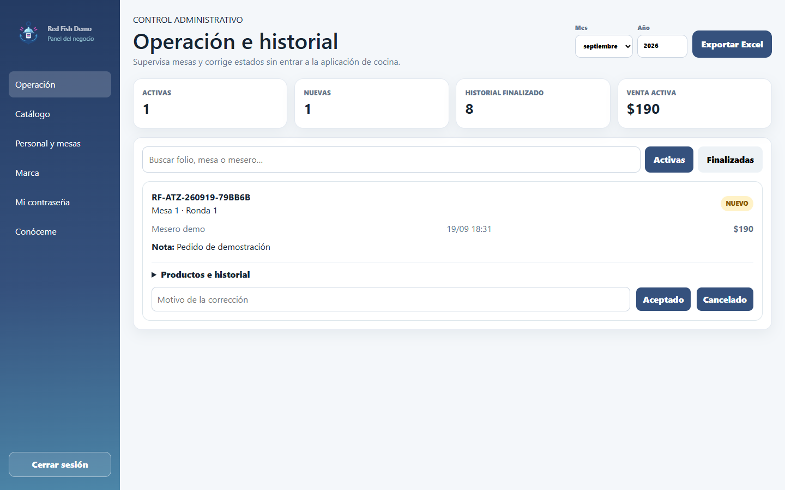

<p align="center">
  
</p>

<h1 align="center">MenuOrders</h1>

<p align="center">
  Plataforma white-label para coordinar mesas, comandas, cocina y administración dentro de la red local de un restaurante.
</p>

<p align="center">
  <a href="https://menuorders.vercel.app/"><strong>Vista pública en Vercel (Recomendado)</strong></a>
  ·
  <a href="https://luics415.github.io/MenuOrders/">Espejo GitHub Pages</a>
  ·
  <a href="https://luics415.github.io/proyectos/menuorders/"><strong>Caso técnico en el portafolio</strong></a>
</p>

> Este repositorio es la documentación y presentación pública del producto. El código operativo, la configuración de cada comprador, las credenciales, los datos del restaurante y los paquetes comerciales se distribuyen por separado.

## Resumen ejecutivo

MenuOrders resuelve el recorrido completo de una comanda sin mezclar responsabilidades: el Mesero toma el pedido desde un celular o tablet, Cocina lo procesa en un tablero visual y Administración controla catálogo, personal, mesas, identidad, historial y exportaciones.

El MVP está diseñado para operar en la red local del establecimiento, con una computadora Windows como servidor central y PostgreSQL como fuente de verdad. La interfaz utiliza Blazor Server y SignalR para mantener sincronizadas las vistas sin exponer la base de datos a los dispositivos del personal.

### Capacidades principales

- Roles separados para Administración, Cocina y Meseros.
- Mesas, rondas, folios y comentarios generales o por producto.
- Alertas visibles de alergia y atajos de especificaciones frecuentes.
- Flujo de cocina `Nuevo → Preparando → Listo → Finalizado`.
- Actualización en tiempo real con recuperación periódica ante reconexiones.
- Catálogo white-label con menús, categorías, productos, precios, disponibilidad, orden e imágenes.
- Identidad configurable: nombre comercial, logotipo, favicon, colores, moneda y prefijo de folio.
- Historial reciente en Cocina y conservación completa en PostgreSQL.
- Exportación XLSX y respaldo transferible de base, imágenes y archivos operativos.
- Publicación Windows autosuficiente y acceso desde navegador/PWA en celulares y tablets.

## Problema y principios de diseño

En un restaurante, el menú visual no es el producto principal: la prioridad es que una orden llegue completa, legible y a tiempo desde la mesa hasta cocina. MenuOrders se diseñó alrededor de cuatro principios:

1. **Una sola fuente de verdad.** El estado real vive en PostgreSQL; Excel es una salida operativa, no una segunda base.
2. **Responsabilidad por rol.** Cada sesión abre únicamente el área necesaria para su trabajo.
3. **Historial inmutable del pedido.** Nombre y precio se guardan como snapshots para que una edición futura del catálogo no cambie ventas anteriores.
4. **Instalación transferible.** Código, binarios, configuración privada y datos del comprador permanecen separados.

## Arquitectura



La solución comercial separa cuatro capas:

| Capa | Responsabilidad |
| --- | --- |
| Dominio | Entidades, estados y reglas centrales de pedidos, productos, mesas y personal. |
| Aplicación | Contratos y casos de uso; no depende de la interfaz. |
| Infraestructura | EF Core, PostgreSQL, migraciones, servicios, almacenamiento y exportación. |
| Presentación | ASP.NET Core, Blazor Server, autorización por rol y actualización SignalR. |

### Flujo de una comanda



## Modelo funcional

Las entidades principales son:

- `Menu`, `Category` y `Product`: catálogo ordenado y configurable.
- `BusinessSettings`: identidad visual y reglas de presentación del negocio.
- `RestaurantTable` y sesión de mesa: contexto del servicio y sus rondas.
- `Order`: folio, mesa, responsable, estado, totales y comentario general.
- `OrderItem`: cantidad, comentario, alerta de alergia y snapshots de nombre/precio.
- `OrderStatusHistory`: trazabilidad cronológica de cada transición.
- `StaffMember`: cuenta, rol, actividad y versión de credenciales.

### Máquina de estados

```text
Nuevo ──► Preparando ──► Listo ──► Finalizado
  │             │           │
  └─────────────┴───────────┴──► Cancelado (con confirmación y motivo)
```

Las transiciones se validan en la aplicación y cada cambio crea una entrada histórica. Los pedidos finalizados permanecen temporalmente en el tablero de Cocina y después salen de la vista activa sin eliminarse de PostgreSQL.

## Experiencia por rol

| Rol | Objetivo | Operaciones principales |
| --- | --- | --- |
| Mesero | Capturar correctamente el servicio de una mesa. | Abrir mesa, crear rondas, consultar disponibilidad, agregar productos, especificaciones, alergias y enviar a cocina. |
| Cocina | Mantener visible el trabajo pendiente y su avance. | Recibir comandas, revisar tiempos, avanzar estados, cancelar con confirmación y consultar historial reciente. |
| Administrador | Gobernar operación, datos e identidad. | Gestionar productos, precios, imágenes, mesas, cuentas, branding, historial, Excel y respaldos. |

## Evidencia visual

### Acceso por rol



### Servicio de mesas



### Tablero de Cocina



### Operación administrativa



## Seguridad y aislamiento

El alcance es una instalación LAN: no debe exponerse directamente a Internet. Las decisiones principales son:

- Autenticación obligatoria y autorización por rol.
- Contraseñas almacenadas únicamente como hashes PBKDF2 con sal aleatoria.
- Contraseñas temporales visibles una sola vez y cambio obligatorio al iniciar.
- Revocación de sesiones cuando cambia la contraseña, el rol o el estado de la cuenta.
- Cookies `HttpOnly` y `SameSite=Strict`, antifalsificación, límites de intentos y cabeceras defensivas.
- Validación de formato, firma binaria y tamaño para imágenes cargadas.
- PostgreSQL limitado al equipo central; los dispositivos acceden solo a la aplicación web.
- Configuración y datos específicos del comprador excluidos del repositorio.

La seguridad final también depende de Windows, PostgreSQL, el router, las contraseñas, las actualizaciones, el cifrado del disco y el control físico del servidor.

## Persistencia, exportación y recuperación

- PostgreSQL conserva pedidos, partidas, precios históricos y transiciones.
- Los archivos XLSX permiten revisión operativa y entrega de reportes, pero no reemplazan la base.
- Los respaldos transferibles incluyen base, imágenes y exportaciones para migrar a otra computadora.
- Los ZIP de respaldo no se consideran cifrados; deben almacenarse en medios protegidos.
- La limpieza visual de Cocina nunca equivale a borrar el historial.

## Despliegue y topología

```text
Computadora central Windows
├── MenuOrders.Admin.exe
├── PostgreSQL local
├── imágenes / exportaciones / respaldos
└── puerto web 5097 para la subred del restaurante

Celulares y tablets
└── http://IP-DE-LA-PC:5097/login
```

La distribución comercial incluye un iniciador de un clic, un asistente de configuración, preparación acotada del firewall, manual PDF y paquetes de respaldo/restauración. La computadora central debe permanecer encendida durante la operación.

## Alcance del MVP

Incluido:

- Servicio en mesa, cocina y administración.
- Operación local multi-dispositivo.
- Catálogo y branding white-label.
- Trazabilidad, Excel y recuperación transferible.
- Interfaz responsive y PWA instalable.

Fuera del alcance actual:

- Pagos en línea y facturación fiscal.
- Delivery, geolocalización y seguimiento de repartidores.
- Sincronización offline entre varias sucursales.
- Exposición pública del servidor sin VPN/HTTPS administrado.
- APK nativo firmado para Android.

## Repositorio público

```text
.
├── .github/workflows/pages.yml  # publicación automática en GitHub Pages
├── .openai/hosting.json         # contrato de hosting estático
├── dist/
│   ├── index.html               # vitrina del producto
│   ├── styles.css
│   ├── script.js
│   └── assets/                  # identidad y capturas reales
└── README.md                    # documentación pública del producto
```

GitHub Pages publica exclusivamente `dist`. No existen credenciales, datos operativos ni código comercial en este repositorio.

## Validación de la entrega pública

- Diseño comprobado en escritorio y viewport móvil de 390 × 844.
- Sin desbordamiento horizontal en la página publicada.
- Capturas, firma e icono verificados como recursos cargados.
- Flujo de ampliación de capturas comprobado.
- Publicación automática mediante GitHub Actions.

## Autoría

Diseñado y desarrollado por **Luics415**.

<p align="center">
  
</p>
